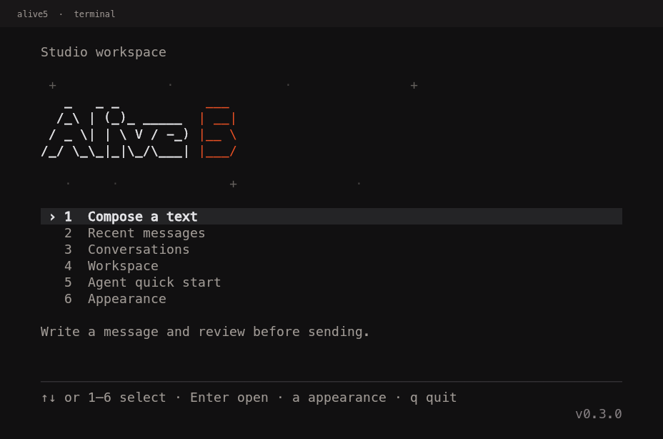

# Alive5 CLI

Alive5 messages and conversations in your terminal. Open a fixed-screen workspace, or run explicit commands from an AI agent or script.



[Compare the eight logos](docs/media/logos-v3.png) · [Watch the motion](docs/media/logo-motion.gif)

```sh
npm install
npm link
alive5
```

Requires Node.js 22 or newer. This is a local preview, not a published npm package. `npm link` installs the `alive5` command from this checkout. You can also use `node bin/alive5.js` without linking.

## The terminal workspace

The header stays visible. Menus, forms, transcripts, and lists replace the content panel instead of adding lines to your shell. Your selected Alive 5 wordmark appears on Home and Appearance. Task screens use a single-line header, leaving room for the form or transcript. Exit restores your previous terminal content.

- Arrow keys or `j`/`k` navigate; Enter opens an item. Keys `1`–`6` select a workspace section.
- `a` opens Appearance. Press `1`–`8` to compare Wordmark, Slash, Outline, Pixel, Dots, Wire, Slab, and Label. Use ↑↓ to choose a setting and ←→ to change it. `s` saves your choice, `r` replays the effect, and Space pauses motion. You can also select Save appearance and press Enter.
- Tab moves between form fields. Ctrl+U clears a field. Ctrl+J adds a line break in Message. Pasted multiline text stays in the field and does not submit it.
- Preview shows the full message and addressing before Enter sends. Esc edits the draft. Overlong text is rejected instead of silently shortened.
- Lists scroll inside their panel with arrows or Page Up/Down. `n` fetches the next API page when available. `q` quits outside text fields; Ctrl+C exits from anywhere.

The eight wordmarks all spell Alive 5, using the brand orange `#EB5124` for the 5. Outline is the initial choice. Light sweep, Slow glow, and Star drift work with every logo. Continuous mode keeps the preview moving; Entrance only runs the effect for 850 ms; Off draws a static logo. The lettering stays visible throughout. Animation is capped near 6 fps after startup and stops on task screens.

Appearance preferences live in `appearance.json` beside the credential file. `--no-animation`, `ALIVE5_NO_ANIMATION=1`, and `NO_COLOR` force motion off. The minimum interactive size is 40×24; 80×24 gives more room for hints and descriptions. Wider wordmarks fall back to plain Alive 5 if a command banner cannot fit them. See [V3 design and research](docs/design-v3.md).

## Connect

Run `alive5` or `alive5 auth login` and paste your existing key. The prompt masks it, validates it against Alive5, and stores it locally. Find the key in **Alive5 → Integrations → API Key**.

For automation, supply `ALIVE5_API_KEY` through your secret manager, or pipe a key into `alive5 auth login --key-stdin`. The CLI deliberately has no API key argument, so keys do not end up in shell history or process arguments.

Credentials use a local JSON file with mode `0600`, at `$XDG_CONFIG_HOME/alive5/credentials.json` or `~/.config/alive5/credentials.json`. This is file protection, not encryption. `ALIVE5_CONFIG_DIR` overrides the directory. An environment key takes precedence. `alive5 auth logout` removes the saved key; it does not unset an environment variable.

## Use it

```sh
# Discover sending numbers, channel IDs, and user IDs
alive5 channels list
alive5 users list --json
alive5 tags list

# Read a small page of contacts
alive5 contacts list --limit 10
alive5 contacts list --page 2 --limit 10 --json

# Read messages sent on September 12, including older threads
alive5 sms list --since 2026-09-12 --until 2026-09-13

# Read full conversation transcripts
alive5 conversations list --type sms --since 2026-09-01 --until 2026-09-13
alive5 conversations list --type livechat --since 2026-09-01 --until 2026-09-13 --timezone=-5:00

# Preview a text without making an API request
alive5 sms send \
  --from +15555550100 --to +15555550101 \
  --channel YOUR_CHANNEL_ID --user YOUR_USER_ID \
  --message 'Your appointment is tomorrow at 10.' --dry-run
```

Replace `--dry-run` with `--yes` to send. In an interactive terminal, omitting both shows the preview and asks you to confirm. Use `--message-file message.txt`, or pipe content into `--message-file -`, for multiline text. Every send requires an explicit sender, recipient, channel, and user. Sender numbers can be found in channel labels when configured that way; the API does not expose a dedicated number directory in this collection.

`--since` and `--until` become date boundaries for the API. Use the next date as `--until` to include a full day. SMS conversation history filters conversation start dates. Use `sms list` for recent messages in older conversations. The CLI translates ISO dates to the API's month-day-year format. Live chat supports an explicit UTC offset; the other date endpoints use the API's own timezone behavior.

## For agents

```sh
alive5 schema
alive5 schema sms send
alive5 channels list --json --fields id,name
alive5 contacts list --json --limit 10
```

Piped output defaults to JSON. `--json` forces it in a terminal. Commands return one JSON document, including failures. No menus, logo, spinner, or confirmation prompts appear in JSON mode. `--help` and `--version` remain standard text; `schema` is the machine-readable discovery command.

```json
{ "ok": true, "data": [], "error": null, "meta": { "schemaVersion": 1 } }
```

Records have consistent names such as `id`, `threadId`, `firstName`, and `startedAt`. Transcripts contain `messages` with `at`, `sender`, and `text`. Available pagination appears in `meta.page`, `meta.totalPages`, and `meta.nextPage`. Lists fetch one page; agents follow `nextPage` explicitly. The SMS message endpoint does not document pagination.

`--raw` returns unwrapped API data with credentials removed. `--fields` selects top-level record fields on read commands. `--output text` requests human output. `NO_COLOR`, `--no-color`, `ALIVE5_NO_ANIMATION=1`, and `--no-animation` control decoration. `--no-input` disables prompts.

See [the agent guide](docs/agents.md) for exit codes and send semantics.

## Scope and known API behavior

The CLI follows the [official Alive5 Postman collection](https://documenter.getpostman.com/view/12135254/UVsQr3zh), reached from [alive5.com/api](https://www.alive5.com/api). It covers account information, channel/user/tag discovery, contacts, SMS send and message history, conversation transcripts, and the documented summary report.

The summary endpoint returned `code: 400` with an empty error object during live verification. `reports summary` exposes that upstream failure with a nonzero exit code. It remains available as a command, outside the default workspace navigation. Some empty conversation ranges return `404 not found` instead of an empty list; the CLI preserves that distinction. Live chat uses zero-based API pages and a last-page index; the CLI converts both to one-based pages. Duplicate transcript records returned by the API are preserved.

API acceptance does not prove handset delivery. Send results therefore include `deliveryConfirmed: false`, even when the API says `sent`. No request is automatically retried. A network failure or server error after sending can mean the message was accepted; inspect Alive5 or the recipient before trying again.

This version leaves out administrative creation, inbound message injection, webhooks, and undocumented MMS parameters. It does not use internal webhook documentation or private application endpoints.

## Development

```sh
npm test        # 16 focused tests, offline, no SMS sent
npm run check  # formatting plus tests
npm run format
npm run demo   # offline interactive fixture
npm run capture # real PTY captures with fake data
```

Tests cover command discovery, errors, credentials, multipart sending, input validation, normalization, pagination, and terminal control characters. Live and agent checks are recorded in [verification](docs/verification.md). Design sources and endpoint mapping are in [research](docs/research.md).
