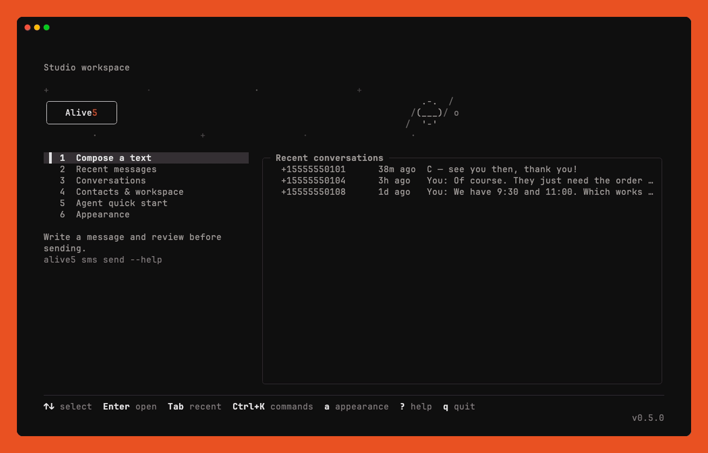
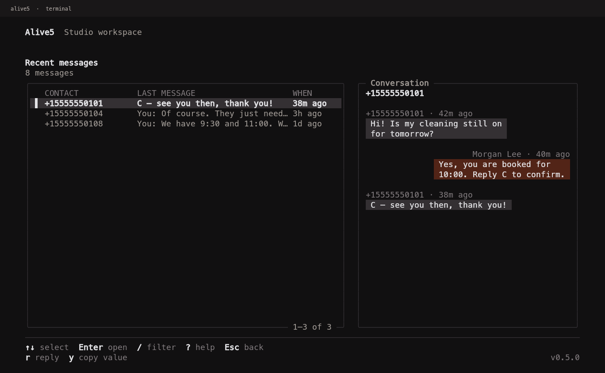
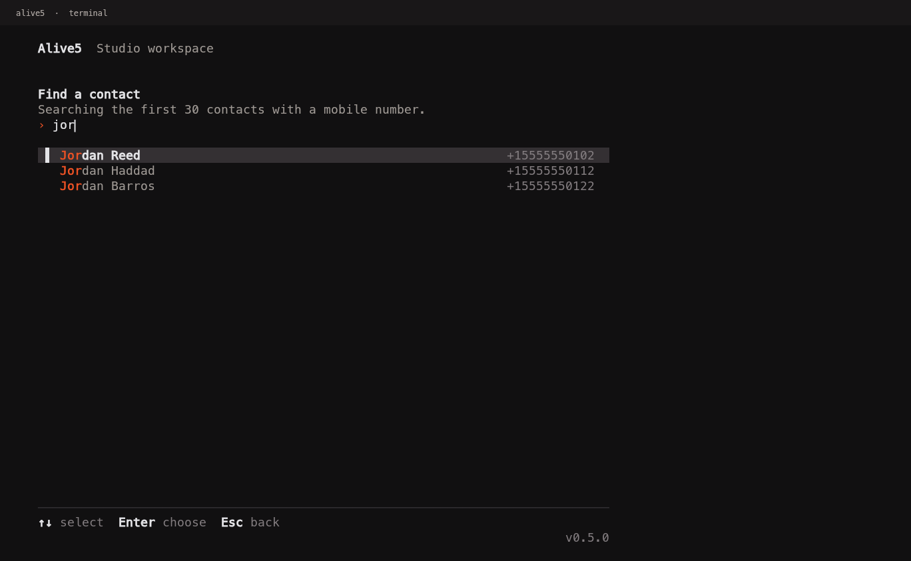

# Alive5 CLI


 [](https://github.com/imraghavojha/alive5-cli/actions/workflows/check.yml)  

Read conversations, reply, and send texts from your terminal. The same commands return clean JSON for scripts and AI agents.



## Installation

The CLI needs Node.js 22 or newer. It is not on npm yet, so install it from this checkout:

```sh
npm install
npm link   # puts alive5 on your PATH
alive5
```

To update, pull, then run `npm ci` and `npm link`. To remove it, run `npm unlink -g @alive5/cli`. You can also run `node bin/alive5.js` without linking.

## Connect your account

Run `alive5` and paste your API key from **Alive5 → Integrations → API Key**. The CLI checks it with Alive5 and saves it to `~/.config/alive5/credentials.json` with mode `0600`. That is file protection, not encryption.

For automation, set `ALIVE5_API_KEY`, or pipe a key into `alive5 auth login --key-stdin`. There is deliberately no key flag, so keys stay out of shell history.

## The workspace

Run `alive5` with no arguments.

<table>
  <tr>
    <td></td>
    <td></td>
  </tr>
</table>

- **Home** shows the last seven days of conversations beside the menu. `Tab` moves between them.
- **Conversations** read like a chat: the customer on the left, your team on the right. `Enter` opens one. `r` replies with the number and channel filled in.
- **Compose** is one form: channel, teammate, sender, recipient, and message. Press `Enter` on an empty field, or `Ctrl+F`, to choose from a list you can search by typing. The CLI remembers your last channel and teammate.
- **Review** lists every consequential choice before anything is sent. If a send result is uncertain, your draft is kept and the next `Enter` does not send it again.
- **`Ctrl+K`** finds any action by name.
- **The mouse works.** Click to select, click again to open, and scroll with the wheel. Hold Shift (Option in Terminal.app and iTerm2) to select text.

| Key               | Does                                                        |
| ----------------- | ----------------------------------------------------------- |
| `↑` `↓` / `j` `k` | Move                                                        |
| `Enter`           | Open or confirm                                             |
| `Esc`             | Go back one step, keeping your draft, selection, and filter |
| `Ctrl+K` / `:`    | Search every action                                         |
| `/`               | Filter the loaded list                                      |
| `r` / `m`         | Reply to a conversation / message a contact                 |
| `y`               | Copy the highlighted value                                  |
| `n`               | Load the next page                                          |
| `?`               | Every shortcut                                              |
| `q`               | Quit. `Ctrl+C` always quits.                                |

**Appearance.** Press `a` to choose one of eight wordmarks, a banner effect, and a Dark, Light, Terminal, or High contrast theme. Motion runs at about 6 fps and stops on task screens. `NO_COLOR`, `ALIVE5_NO_ANIMATION=1`, or `--no-animation` turn it off. [Compare the logos](docs/media/logos-v3.png) · [See the motion](docs/media/logo-motion.gif)

**Line mode.** `alive5 --linear` runs the same workspace as plain lines of text, without full-screen drawing. It is meant for screen readers, logs, and slow connections, but it has not yet been tested with a screen reader.

The workspace needs at least 40×24. Wider terminals get side-by-side panes.

## Commands

```sh
alive5 channels list        # sending numbers, channel IDs, and user IDs
alive5 contacts list --limit 10
alive5 sms list --since 2026-09-12 --until 2026-09-13
alive5 conversations list --type livechat --since 2026-09-01 --until 2026-09-08
alive5 sms send --from +15555550100 --to +15555550101 \
  --channel CHANNEL_ID --user USER_ID --message 'See you at 10.' --dry-run
alive5 doctor               # local checks, no network
alive5 completion zsh > "${fpath[1]}/_alive5"
```

`--dry-run` validates locally and prints the exact form without calling the API. Replace it with `--yes` to send. To include a full day, set `--until` to the day after.

## For agents and scripts

Piped output is JSON: one envelope per command, errors included.

```json
{ "ok": true, "data": [], "error": null, "meta": { "schemaVersion": 1 } }
```

- `alive5 schema` describes every command, flag, exit code, and side effect.
- Exit codes: 0 ok · 1 local · 2 usage · 3 auth · 4 API · 5 rate limit · 130 cancelled.
- A mistyped command returns `UNKNOWN_COMMAND` with `error.details.suggestions`. A missing flag returns `MISSING_OPTION` with `error.field`.
- Nothing prompts when output is piped. Sending needs `--yes` and never retries.

The [agent guide](docs/agents.md) covers send semantics, pagination, and untrusted content.

## Good to know

- When Alive5 accepts a text, that does not confirm it reached the handset, so send results say `deliveryConfirmed: false`. A send that fails on the network may still have gone through; check before you resend.
- The API does not say which side sent a message. The workspace treats a phone-number sender as the customer.
- The CLI follows the [public Postman collection](https://documenter.getpostman.com/view/12135254/UVsQr3zh). Known API quirks are in [research](docs/research.md), and the live checks are in [verification](docs/verification.md).

## Development

```sh
npm test            # offline; never sends a message
npm run check       # formatting and tests
npm run demo        # the workspace with fake data
npm run capture     # PTY screenshots into .local/design
vhs docs/demo.tape  # re-record the GIF above with Charm's VHS
```

[AGENTS.md](AGENTS.md) explains where things live and how changes are checked.

## License

UNLICENSED. Private to Alive5.
